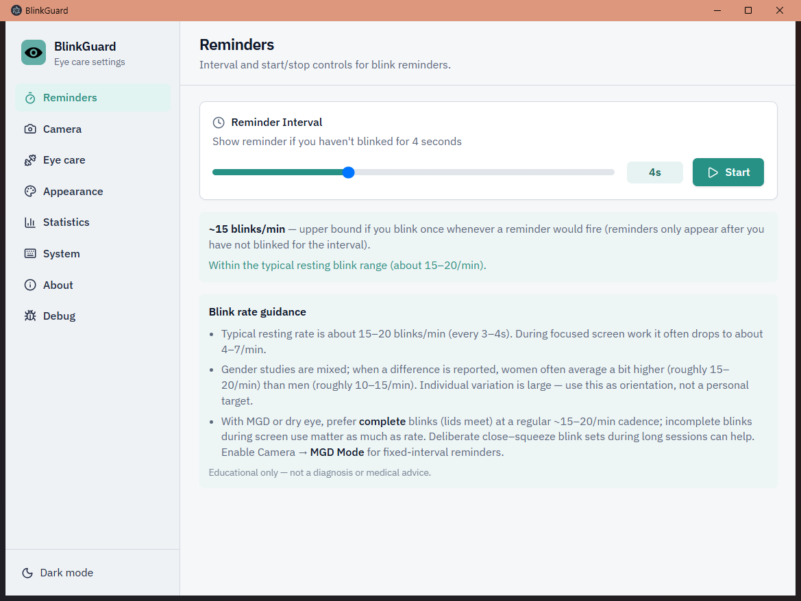
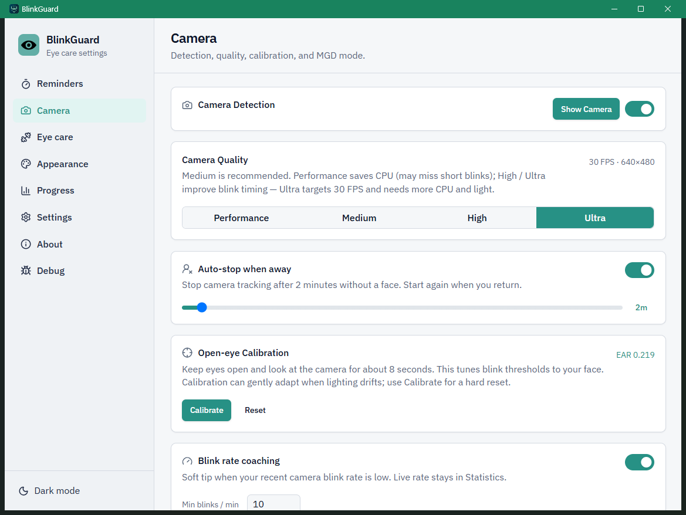
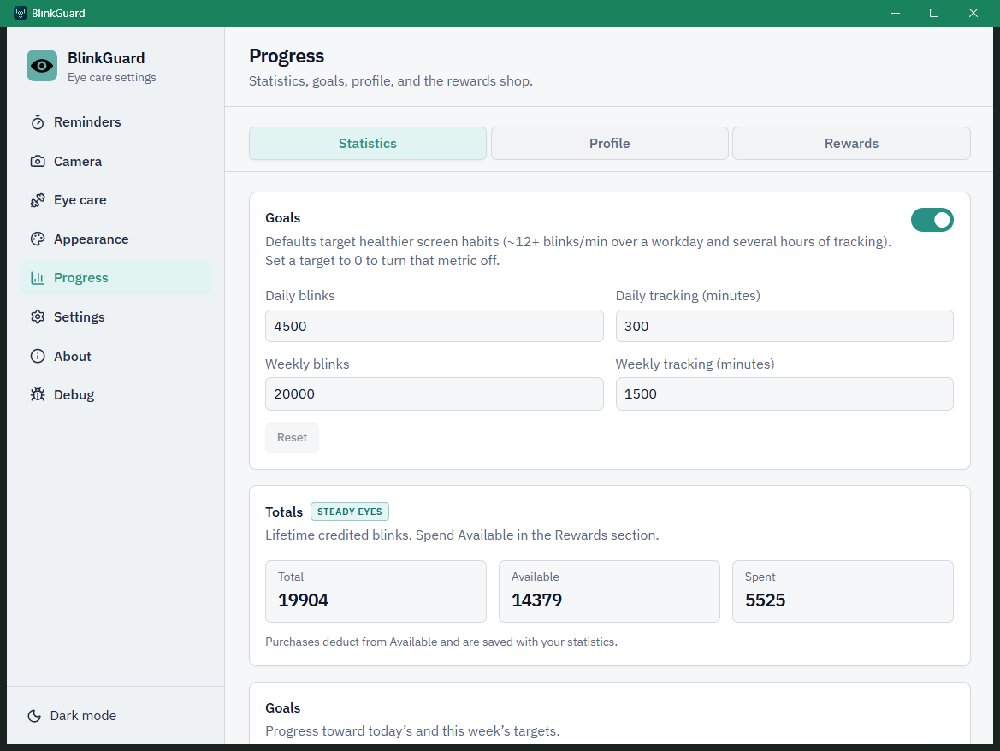

# BlinkGuard

Cross-platform desktop app that helps prevent dry eyes and eye strain with blink reminders and optional camera-based blink detection.

**Homepage / source:** https://github.com/xpogx-org/BlinkGuard · **Privacy:** [PRIVACY.md](PRIVACY.md) · **Security:** [SECURITY.md](SECURITY.md) · **Changelog:** [CHANGELOG.md](CHANGELOG.md)

## Features

- **Blink reminders** — start/stop tracking from the control panel; interval slider from 1–10 seconds
- **Timer mode** — show a reminder popup on a fixed interval
- **Camera blink detection (optional)** — OpenCV YuNet + dlib sidecar; ROI gates, personal blink calibration, pose/per-eye vetoes, and adaptive EAR; reminds you only when you haven’t blinked for the set interval
- **MGD mode** — when camera detection is on, show timed popups even while blinking; the popup still closes when a blink is detected
- **Camera visualization** — optional live preview (up to Ultra 30 FPS) with face/eye landmarks and EAR status
- **Eye exercise reminders** — can run independently of blink reminders; configurable interval (5–60 minutes); Skip / configurable Snooze; auto-close after 30 seconds
- **20-20-20 look-away breaks** — independent timer alongside exercises; editable title/hint
- **Customizable reminder popup** — drag to reposition, resize with edge handles, custom message, colors, and transparency
- **Global keyboard shortcuts** — multi-action bindings (default includes `Ctrl+I`; rebindable)
- **Sounds** — optional notification sounds for blink and exercise popups (per-kind volume)
- **Quiet hours & fullscreen soft-pause** — hide popups when you ask for quiet time or go fullscreen
- **Progress** — stats, goals/streaks, blink levels, rewards shop, and share-card preview in one nav section
- **Backup** — export/import local prefs and stats as JSON
- **Dark / light mode** · **EN / UK** localization
- **Persistent preferences** — saved locally via `electron-store` (reset-to-defaults supported)
- **Sleep / wake handling** — pauses on suspend and auto-resumes if tracking was active
- **In-app updates (Windows & macOS)** — GitHub Releases (background check every 6h); silent install on quit; About opens Release Notes
- **Diagnostics export** — local logs and interaction trail for support
- **Cross-platform packaging** — Windows and macOS (Electron Builder)

## Screenshots








## Install

Download the latest Windows installer or macOS DMG from [GitHub Releases](https://github.com/xpogx-org/BlinkGuard/releases/latest).

### Windows

Run `BlinkGuard.Setup.exe` and follow the installer.

### macOS Gatekeeper (“app is damaged”)

GitHub macOS builds are often **unsigned** (no Apple Developer ID / notarize in CI). After a browser download, macOS attaches a quarantine flag. Gatekeeper then shows:

> “BlinkGuard” is damaged and can’t be opened. You should move it to the Trash.

The app is not corrupt. **Right-click → Open does not bypass this dialog.** After dragging BlinkGuard into Applications, strip the quarantine flag in Terminal:

```bash
xattr -cr /Applications/BlinkGuard.app
```

Then open the app again. If it lives somewhere else, pass that path instead.

Signed + notarized builds do not need this step.

## Technology stack

| Area | Stack |
|---|---|
| UI | React 18, TypeScript, Vite, Tailwind CSS, Lucide |
| Desktop | Electron 30, `electron-store`, `electron-updater` |
| Computer vision (optional) | Python, OpenCV, dlib, NumPy, PyInstaller |
| Tooling | Biome, Vitest, Electron Builder |

## Architecture

Pragmatic Clean Architecture: domain/application stay free of Electron/React/OpenCV; infrastructure and UI adapters sit outside. `electron/main.ts` is a thin composition root — orchestration lives in `electron/application/`, Electron/Node I/O in `electron/infrastructure/`. Details, Flutter analogies, and anti-patterns: [docs/architecture.md](docs/architecture.md). IPC/preference traps: [docs/ipc-and-preferences.md](docs/ipc-and-preferences.md).

```text
React settings / public popups / IPC
        ↓
application services + ports
        ↓
domain policies          ←  infrastructure adapters (store, paths, process, sidecar protocol, …)
shared/ (IPC + preference contracts)
optional Python package: domain → application → infrastructure
```

| Want to change… | Open… |
|---|---|
| Settings UI | `src/app.tsx`, `src/features/*/ui`, `src/features/*/model`, `src/shared/ipc/` |
| Popup look / copy | `public/*.html`, `public/css/`, `public/js/` |
| Reminder / face-gate rules | `electron/domain/reminder-policy.ts`, `electron/application/reminder-service.ts` |
| Preferences shape / defaults | `shared/preferences.ts`, `electron/application/preferences-service.ts`, `electron/infrastructure/store/` |
| Camera / sidecar | `python/blink_detector_package/`, `electron/infrastructure/sidecar/` |
| Packaging | `package.json` → `"build"` (Electron Builder); optional binary via `python/build_and_install.sh` |

## Development

The desktop app runs **without** the camera sidecar. Reminders, exercises, look-away, progress, and settings all work with Node/npm only. Camera blink detection is optional and off by default (`cameraEnabled: false`); when you enable it, frames stay on-device (see [PRIVACY.md](PRIVACY.md)).

### Core app

Requires **Node.js 22+** (LTS is fine).

```bash
npm install
npm run dev          # Vite + Electron (needs a display)
npm run lint         # Biome (writes fixes)
npm run coverage     # Vitest one-shot
npm run build:electron
```

On startup you may see `Blink detector binary not found …` — that is expected until you build the optional sidecar below. Timer-mode reminders still work.

See `AGENTS.md` for Cursor Cloud–specific notes.

### Optional camera sidecar

Only needed if you want OpenCV/dlib blink detection or the live camera preview. You need a webcam, [Git LFS](https://git-lfs.com/) for the landmarks model, the committed YuNet ONNX (`electron/assets/models/face_detection_yunet_2023mar.onnx`), and a Python toolchain that can install `dlib`.

**Python version:** use **3.11** (same as CI). Very new releases (e.g. **3.14**) often have no prebuilt `dlib` wheel on Windows; `pip` then tries to compile from source and fails without a C++ toolchain.

**Windows C++ toolchain:** Visual Studio Code is an editor only — it does **not** include a compiler. Install [Visual Studio Build Tools](https://visualstudio.microsoft.com/visual-cpp-build-tools/) (or Visual Studio) with the **Desktop development with C++** workload before `pip install dlib`.

```bash
git lfs pull   # ~99 MB model: electron/assets/models/shape_predictor_68_face_landmarks.dat

# macOS / Linux
cd python
./setup.sh
./build_and_install.sh

# Windows (cmd)
cd python
setup.bat
build_and_install.bat
```

That installs deps into `python/venv`, builds a PyInstaller binary, and copies it to `electron/resources/`. Restart `npm run dev` afterward. Without the binary, leave camera detection off — the rest of the app is unaffected.

### Sharper UI text (Windows + NVIDIA)

Popup transparency is applied to the **panel background** (CSS alpha), not `BrowserWindow.setOpacity`, so glyphs stay fully opaque. Frosted panels use a blur underlay behind text. Settings no longer force grayscale font smoothing.

If text still looks soft on NVIDIA:

1. NVIDIA Control Panel → Manage 3D settings → Program Settings → BlinkGuard (or Electron)
2. Antialiasing - Mode → **Application-controlled**
3. Disable **MFAA**, **FXAA**, and **Enhance application setting** for that profile
4. Compare at **100%** Windows display scale when testing

Tradeoff: less driver AA for that app profile; in-app glass may look slightly less frosted than before.

### Packaging notes

- Local Windows package (always unsigned): `npm run build:windows`
- CI publish (GitHub Actions on **Release published**, or manual workflow_dispatch): `npm run build:windows:publish` via `scripts/publish-windows.js`
  - Signs when `CSC_LINK` (and `CSC_KEY_PASSWORD` if needed) are set
  - Otherwise packages unsigned so CI still ships artifacts
- Local macOS package (unsigned, no notarize): `npm run build:mac`
- CI macOS publish: `npm run build:mac:publish` via `scripts/publish-mac.js`
  - Signs/notarizes when Apple + signing secrets (`CSC_LINK` / `CSC_NAME`, `APPLE_ID`, `APPLE_APP_SPECIFIC_PASSWORD`, `APPLE_TEAM_ID`) are set
  - Otherwise packages **unsigned** so CI still ships DMG/ZIP + `latest-mac.yml` (job does not skip)
- In-app updates need a **published** build with embedded `app-update.yml` (tag/`build:*:publish`); local `--publish never` packages have no feed. Signed + notarized mac builds are recommended for Gatekeeper; unsigned releases may still publish updater metadata but install can fail at runtime without crashing the app.
- End-user workaround for unsigned Mac downloads: see [Install](#install) (`xattr -cr`). Local `npm run remove-quarantine` only clears the builder machine, not testers who downloaded via Chrome/Safari.

---

## Connect

[](https://github.com/xpogx-org/BlinkGuard)
[](https://t.me/PaOnGa)
[](https://www.linkedin.com/in/pavlo-dzhevaha-342068105/)
[](https://opencollective.com/xpogx)
[](mailto:pavel19.1078@gmail.com)

BlinkGuard is a personal project by **Pavlo Dzhevaha** — built locally, from the heart, after enough dry eyes from long coding sessions. Issues, ideas, and PRs are welcome.

---

## Star BlinkGuard

If BlinkGuard helps your eyes on long screen days, a star helps others find it and keeps development going.

**BlinkGuard** — a quiet, local companion for your eyes

[](https://github.com/xpogx-org/BlinkGuard/subscription)
[](https://github.com/xpogx-org/BlinkGuard/fork)
[](https://github.com/xpogx-org/BlinkGuard/stargazers)

## Third-party attribution

BlinkGuard is originally based on [ScreenBlink](https://github.com/katunli/ScreenBlink) by Katun Li. Copyright and license notices for that lineage are recorded in [NOTICE](NOTICE). BlinkGuard is maintained independently under the MIT License ([LICENSE](LICENSE)).
